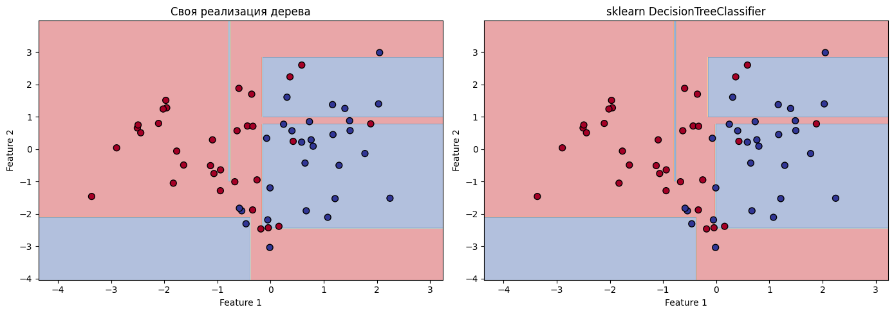
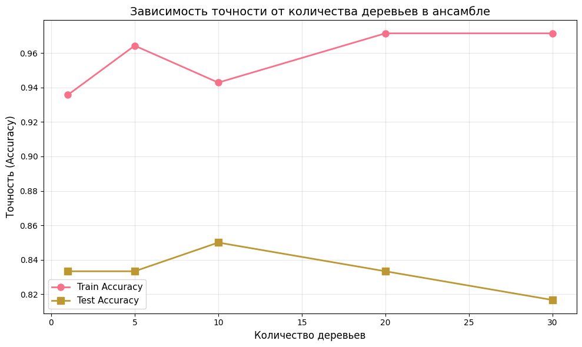
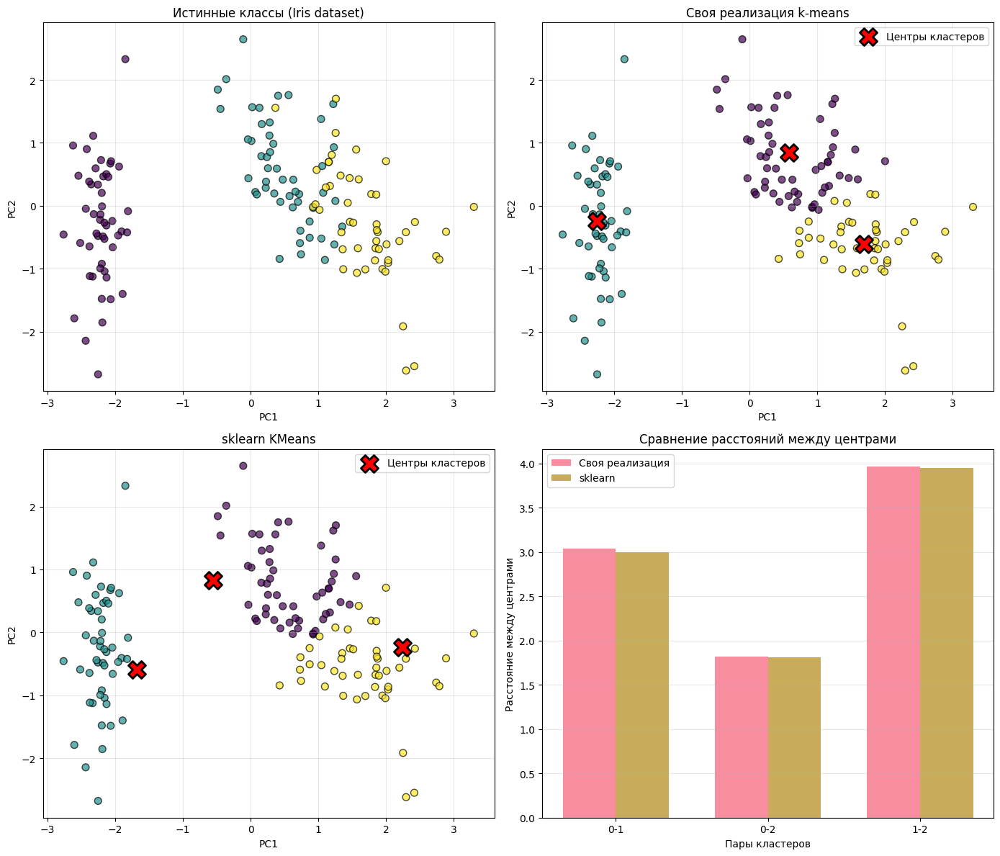

# Сессионное задание по дисциплине «Дополнительные главы высшей математики» - `Александра Бужор`
# Итоговый проект: От дерева решений к ансамблю и кластеризации

## 📋 Описание проекта

Проект по машинному обучению, в котором реализованы с нуля:
- Дерево решений (Decision Tree)
- Ансамбль деревьев через бэггинг (Bagging)
- Алгоритм кластеризации K-means
- Метод главных компонент (PCA)

## 🎯 Цель проекта

Закрепить понимание принципов работы алгоритмов машинного обучения через собственную реализацию и анализ их поведения на данных.

## 🛠️ Технологии

- Python 3.8+
- NumPy
- Pandas
- Matplotlib
- Seaborn
- Scikit-learn

## 📦 Установка

### 1. Клонируй репозиторий:
```bash
git clone https://github.com/твой-username/ml-project.git
cd ml-project
```

### 2. Создай виртуальное окружение:
```bash
python -m venv venv

# Активация на Windows:
venv\Scripts\activate

# Активация на Mac/Linux:
source venv/bin/activate
```

### 3. Установи зависимости:
```bash
pip install -r requirements.txt
```

## 🚀 Запуск

### Вариант 1: Jupyter Notebook
```bash
jupyter notebook notebook.ipynb
```

### Вариант 2: Jupyter Lab
```bash
jupyter lab notebook.ipynb
```

### Вариант 3: VS Code
Открой `notebook.ipynb` в VS Code с расширением Jupyter

## 📊 Структура проекта
```
ml-project/
│
├── README.md                 # Этот файл
├── requirements.txt          # Зависимости Python
├── notebook.ipynb           # Основной Jupyter Notebook
├── images/                  # Сгенерированные графики
│   ├── decision_boundaries.png
│   ├── bagging_accuracy.png
│   └── clustering_results.png
└── .gitignore              # Игнорируемые файлы
```

## 📈 Результаты

### Этап 1: Дерево решений
- ✅ Реализован алгоритм с критерием Джини
- ✅ Точность сравнима со sklearn
- ✅ Визуализация границ решений

### Этап 2: Ансамбль (Бэггинг)
- ✅ Реализован механизм bootstrap-выборок
- ✅ Улучшение качества с ростом числа деревьев
- ✅ Снижение переобучения

### Этап 3: Кластеризация
- ✅ Реализован K-means с нуля
- ✅ Реализован PCA для визуализации
- ✅ Результаты близки к sklearn

## 📸 Примеры визуализаций

### Границы решений дерева


### Точность ансамбля


### Кластеризация Iris


## 📝 Лицензия

MIT License